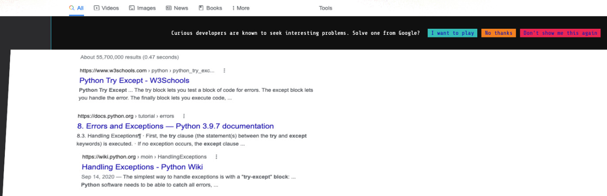
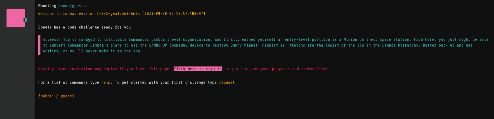
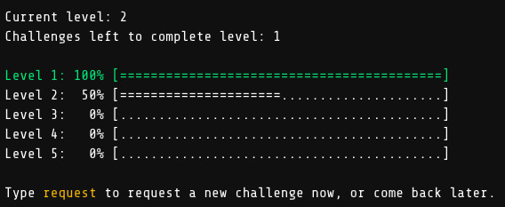
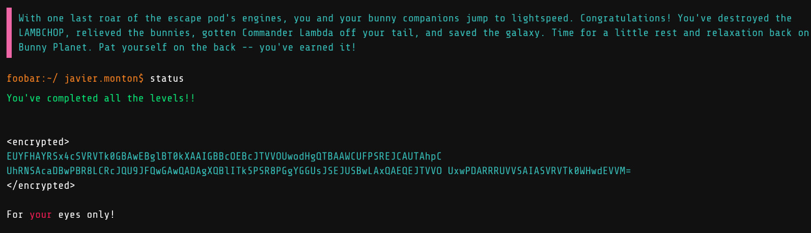

# foo.bar.withgoogle
This is a repository of the solutions that I did for [foo.bar Challenge](https://foobar.withgoogle.com/) from Google

It seems to be a way that Google has to hire some people but I'm not sure about that, 
I took it as a game, pretty similar to HackerRank contexts.

# How it starts

I was searching something simple about Python in Google (I'm not a Python expert, 
I prefer statically typed languages and I usually work with [Scala](https://www.scala-lang.org/))
when suddenly the results page of Google did an animation and showed a message saying:
"Curious developers are known to seek interesting problems. Solve one for Google?"

I was really surprised about that, 15 years coding and I never saw that before. With no doubt, I clicked "I want to play".

Then a new website appears, it seems like a computer console so I started to try commands like `ls` and `help`.
I found a list of commands and a few explanations. `request` command gives you a new code challenge.

# Levels

There are 5 levels, and different number of problems for each level. These are the solutions that I developed, and
I'm posting them as a curiosity, and as small help to others. 
I encourage others to take ideas, or to use the code to test new scenarios, but not to copy&paste the code as solution.
The code it isn't the best one anyway, I'm not really familiar with Python and 
I focused on the algorithm more than best coding practices.

I chose Python over Java because it is easier, it needs less boilerplate code to start coding, 
and it uses arbitrary precision for numbers, thing that it's really useful during these exercises. 
I would have chosen Scala if I could :cry:

Level 1

- [The cake is not a lie](./level1/the-cake-is-not-a-lie)

Level 2

- [En Route Salute](./level2/en-route-salute)
- [Ion Flux Relabeling](./level2/ion-flux-relabeling)

Level 3

- [Doomsday Fuel](./level3/doomsday-fuel)
- [Fuel Injection Perfection](./level3/fuel-injection-perfection)
- [Prepare the Bunnies Scape](./level3/prepare-the-bunnies-scape)

Level 4

- [Bringing a Gun to a Trainer Fight](./level4/bringing-a-gun-to-a-trainer-fight)
- [Distract the trainers](./level4/distract-the-trainers)

Level 5

- [Expanding Nebula](./level5/expanding-nebula)

# Progress
`status` command gives a visualization of the completed levels

At the end it just shows the final message

# Finishing
After level 3, the platform asks you for your personal contact (email, phone, etc) 
and says that a recruiter from Google may reach you

After level 5 a small animation appears and, an encrypted message says you something like congratulations.

